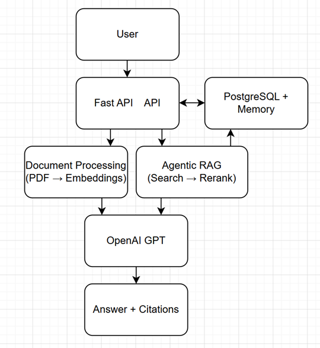
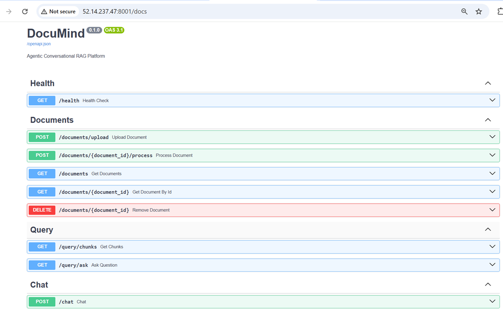
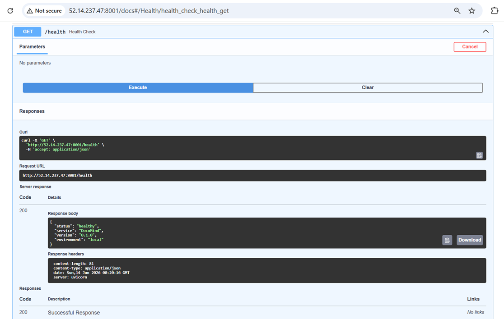
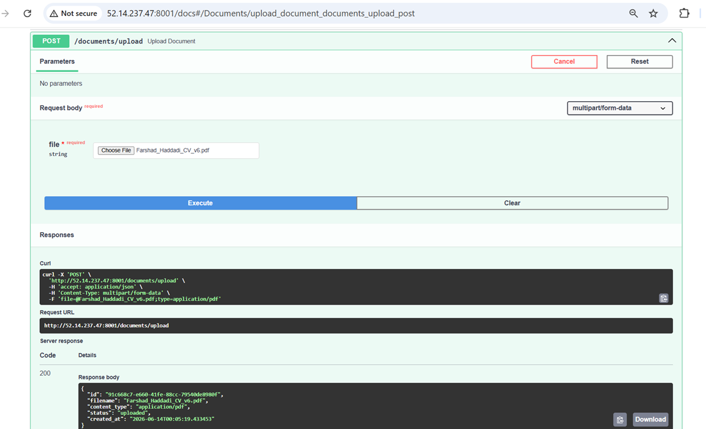
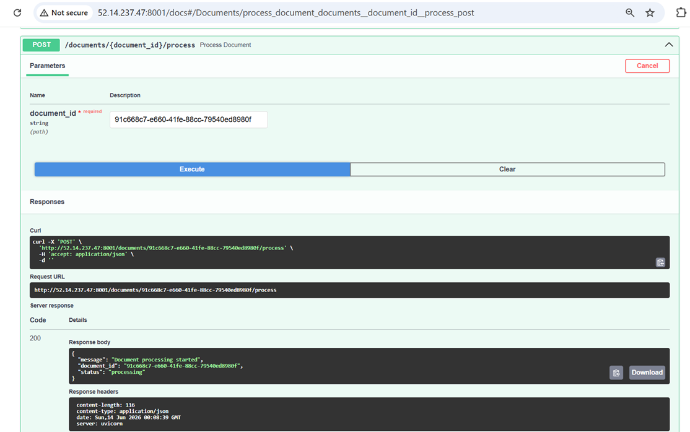
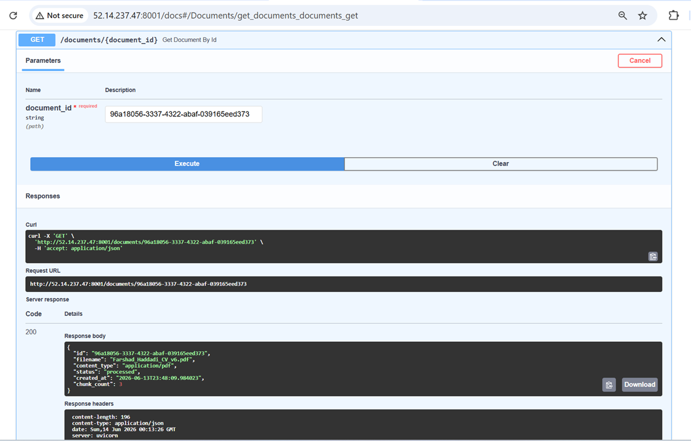
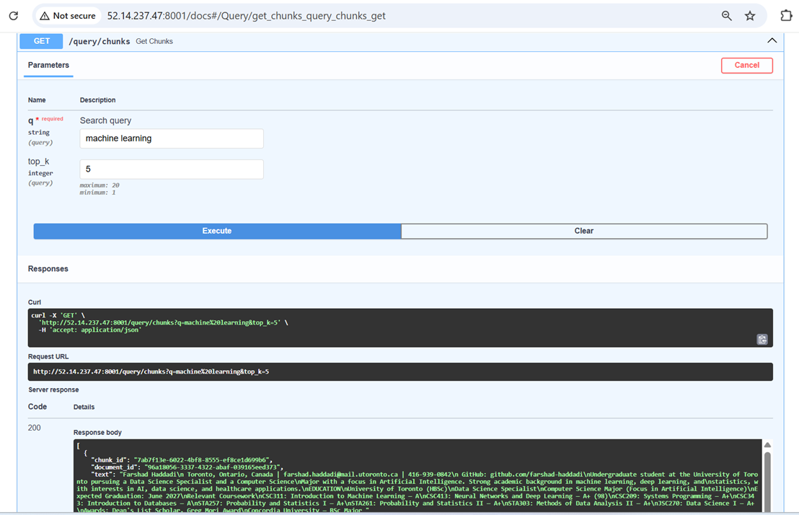
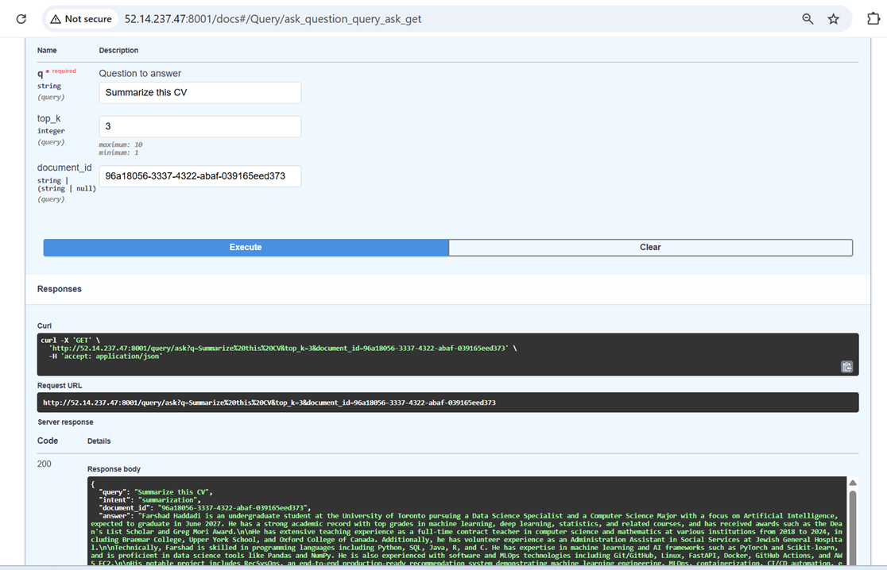
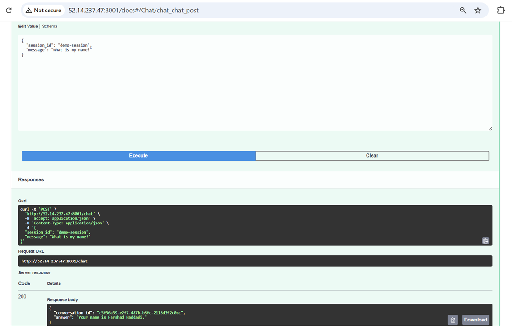

# DocuMind – Agentic Conversational RAG Platform

An end-to-end Agentic Retrieval-Augmented Generation (RAG) platform built with FastAPI, PostgreSQL, OpenAI, and Docker.

DocuMind enables users to upload PDF documents, generate embeddings, perform semantic search, answer questions with citations, and maintain persistent conversational memory across sessions.

---

## Features

### Document Management
- Upload PDF documents
- Store document metadata
- Track document processing status
- Delete documents and associated chunks

### Background Processing
- Asynchronous document ingestion
- PDF text extraction
- Intelligent text chunking
- OpenAI embedding generation
- Vector indexing

### Semantic Search
- Embedding-based retrieval
- Top-K chunk search
- Document filtering
- Similarity ranking

### Agentic RAG Pipeline
- Query understanding
- Semantic retrieval
- Reranking
- GPT-based answer generation
- Source citation support

### Conversational Memory
- Session-based chat history
- Persistent memory storage
- Multi-turn conversations
- Context-aware responses

### Infrastructure
- FastAPI backend
- PostgreSQL database
- OpenAI integration
- Docker containerization
- Swagger/OpenAPI documentation
- AWS deployment ready

---

# System Architecture



**Figure 1. High-Level Architecture of the DocuMind Agentic RAG Platform**

The system combines FastAPI, PostgreSQL, OpenAI GPT, and an Agentic RAG pipeline. Uploaded documents are transformed into embeddings and stored for retrieval. User questions are processed through retrieval, reranking, and answer generation while maintaining conversational memory.

---

# Technology Stack

| Layer | Technology |
|---------|------------|
| Backend | FastAPI |
| Database | PostgreSQL |
| LLM | OpenAI GPT |
| Embeddings | OpenAI Embeddings |
| Search | Vector Similarity Search |
| Reranking | Cross-Encoder Reranking |
| Containerization | Docker |
| Deployment | AWS EC2 |
| Documentation | Swagger/OpenAPI |

---

# API Documentation

Interactive API documentation is available through Swagger UI.



**Figure 2. Swagger/OpenAPI Documentation**

---

# Health Check Endpoint

Endpoint:

```http
GET /health
```



**Figure 3. Health Monitoring Endpoint**

Example Response:

```json
{
  "status": "healthy",
  "service": "DocuMind",
  "version": "0.1.0",
  "environment": "local"
}
```

---

# Document Upload

Users can upload PDF documents for indexing and retrieval.

Endpoint:

```http
POST /documents/upload
```



**Figure 4. PDF Document Upload**

Example Response:

```json
{
  "id": "document-id",
  "filename": "resume.pdf",
  "status": "uploaded"
}
```

---

# Background Document Processing

After upload, documents are processed asynchronously.

Processing steps:

1. Extract PDF text
2. Split into chunks
3. Generate embeddings
4. Store vectors
5. Update document status

Endpoint:

```http
POST /documents/{document_id}/process
```



**Figure 5. Asynchronous Document Processing Pipeline**

Example Response:

```json
{
  "message": "Document processing started",
  "document_id": "document-id",
  "status": "processing"
}
```

---

# Document Status Tracking

Retrieve document metadata and processing status.

Endpoint:

```http
GET /documents/{document_id}
```



**Figure 6. Processed Document Metadata**

Example Response:

```json
{
  "id": "document-id",
  "filename": "resume.pdf",
  "status": "processed",
  "chunk_count": 3
}
```

---

# Semantic Search

Retrieve the most relevant chunks using vector similarity search.

Endpoint:

```http
GET /query/chunks
```

Parameters:

| Parameter | Description |
|------------|-------------|
| q | Search query |
| top_k | Number of chunks returned |



**Figure 7. Vector-Based Semantic Retrieval**

Example Query:

```text
machine learning
```

---

# Agentic RAG Question Answering

The Agentic RAG pipeline performs:

1. Intent classification
2. Semantic retrieval
3. Reranking
4. Context construction
5. GPT answer generation
6. Citation generation

Endpoint:

```http
GET /query/ask
```

Parameters:

| Parameter | Description |
|------------|-------------|
| q | User question |
| top_k | Retrieved chunks |
| document_id | Optional document filter |



**Figure 8. Citation-Grounded Question Answering**

Example Query:

```text
Summarize this CV
```

Example Response:

```json
{
  "query": "Summarize this CV",
  "intent": "summarization",
  "answer": "...",
  "citations": [...]
}
```

---

# Conversation Memory

DocuMind supports persistent conversational memory using PostgreSQL.

Capabilities:

- Multi-turn conversations
- Context preservation
- Session memory
- Memory-aware responses

Endpoint:

```http
POST /chat
```

Example Request:

```json
{
  "session_id": "demo-session",
  "message": "My name is Farshad"
}
```

Follow-up Request:

```json
{
  "session_id": "demo-session",
  "message": "What is my name?"
}
```



**Figure 9. Persistent Conversation Memory**

Example Response:

```json
{
  "answer": "Your name is Farshad Haddadi."
}
```

---

# Running Locally

Clone the repository:

```bash
git clone https://github.com/farshad-haddadi/documind.git
cd documind
```

Create environment variables:

```bash
cp .env.example .env
```

Build and start services:

```bash
docker compose up -d --build
```

Run database migrations:

```bash
alembic upgrade head
```

Open Swagger UI:

```text
http://localhost:8000/docs
```

---

# Deployment

DocuMind can be deployed using Docker on:

- AWS EC2
- Azure VM
- Google Cloud VM
- DigitalOcean Droplets

Production deployment includes:

- Docker Compose orchestration
- PostgreSQL persistence
- OpenAI integration
- Health monitoring endpoint

---
# Author

**Farshad Haddadi**

University of Toronto  
Data Science Specialist & Computer Science Major

GitHub: https://github.com/farshad-haddadi

LinkedIn: https://www.linkedin.com/in/farshad-haddadi